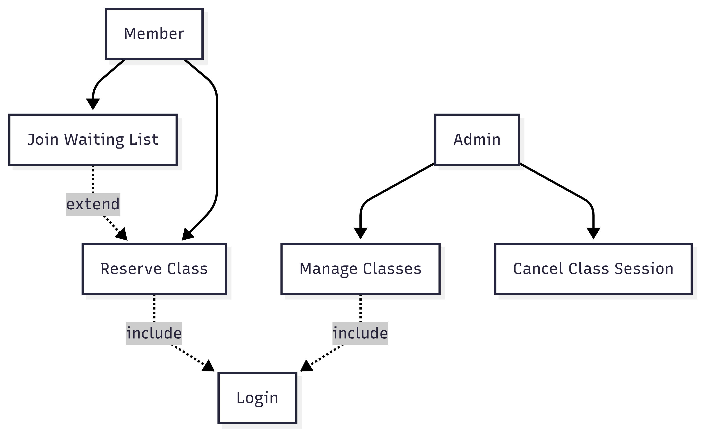
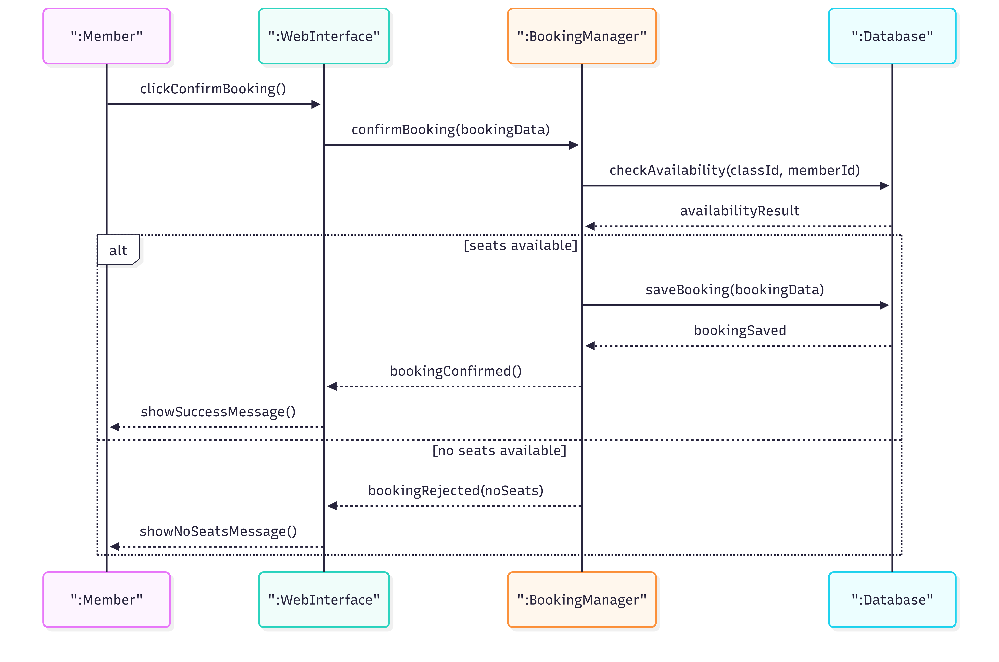
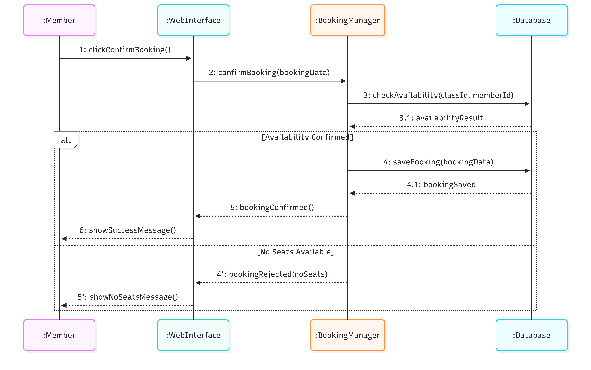

# Entornos-7.5
ejercicio 1
Incluye el diagrama de casos de uso con los actores Member y Admin, el límite del sistema y las relaciones <<include>> y <<extend>> necesarias para representar el proceso de reserva de clases.

ejercicio 2
Añade el diagrama de secuencia que modela la interacción temporal entre Member, WebInterface, BookingManager y Database cuando se confirma una reserva. Incluye fragmento alt para gestionar disponibilidad.

ejercicio3
Incorpora el diagrama de comunicación que representa los mismos mensajes del diagrama de secuencia, pero numerados y centrados en los enlaces entre objetos.

